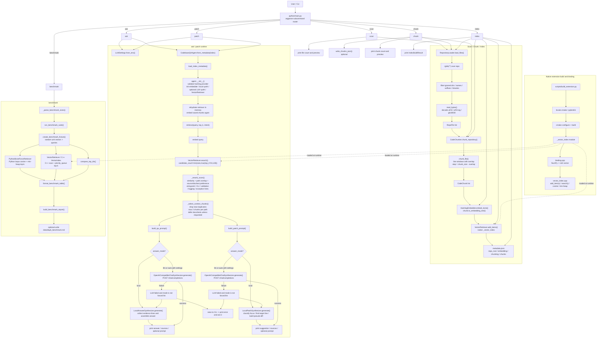
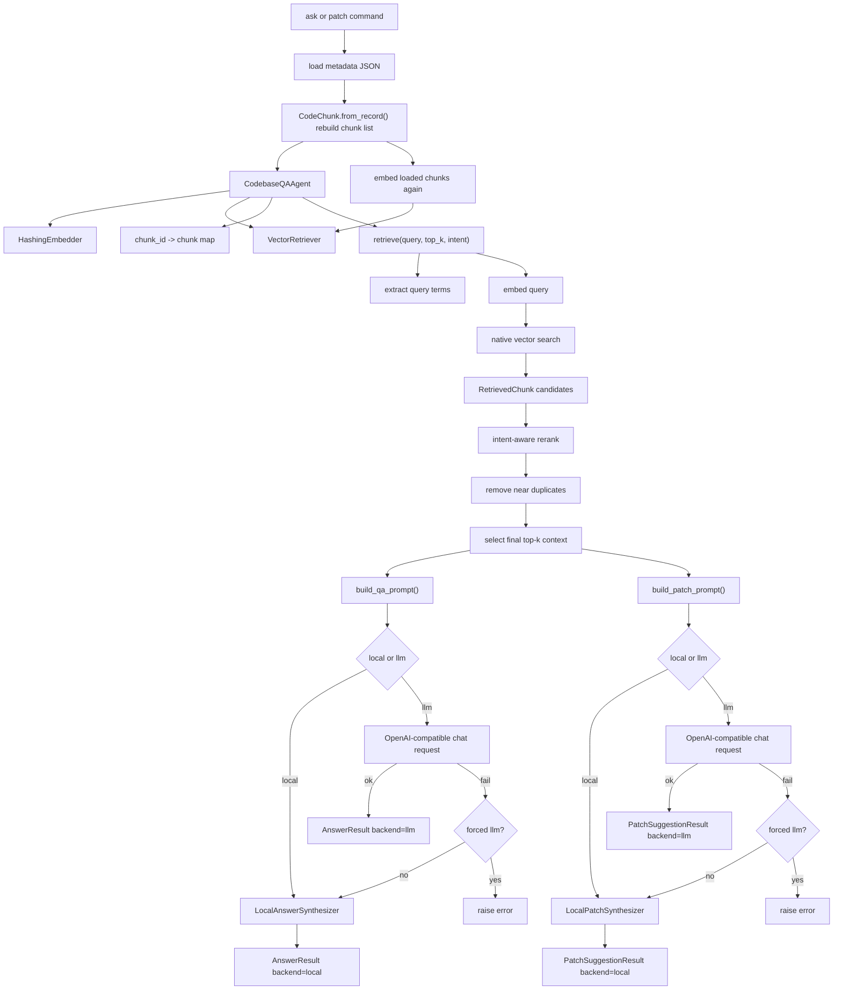
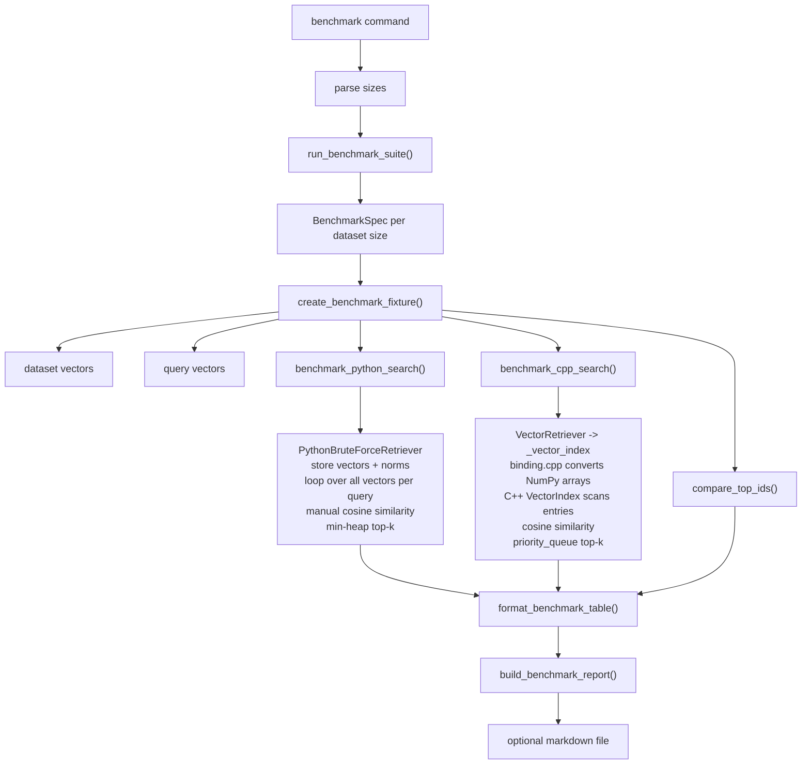

# Codebase Copilot Detailed Flow

This file is generated from the repository code paths, primarily:

- `python/main.py`
- `python/codebase_copilot/pipeline.py`
- `python/codebase_copilot/repo_loader.py`
- `python/codebase_copilot/chunker.py`
- `python/codebase_copilot/embedder.py`
- `python/codebase_copilot/agent.py`
- `python/codebase_copilot/retriever.py`
- `python/codebase_copilot/llm.py`
- `python/codebase_copilot/prompt.py`
- `python/codebase_copilot/benchmark.py`
- `cpp/src/binding.cpp`
- `cpp/src/vector_index.cpp`

## Overview

## Ask / Patch Detail

## Benchmark Detail

